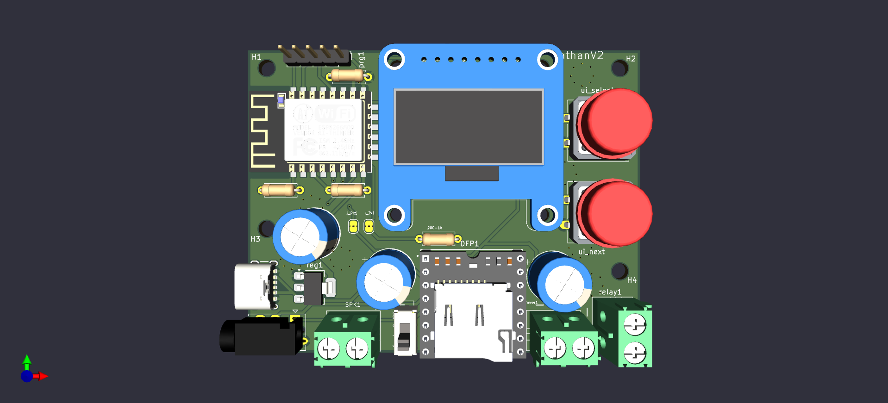
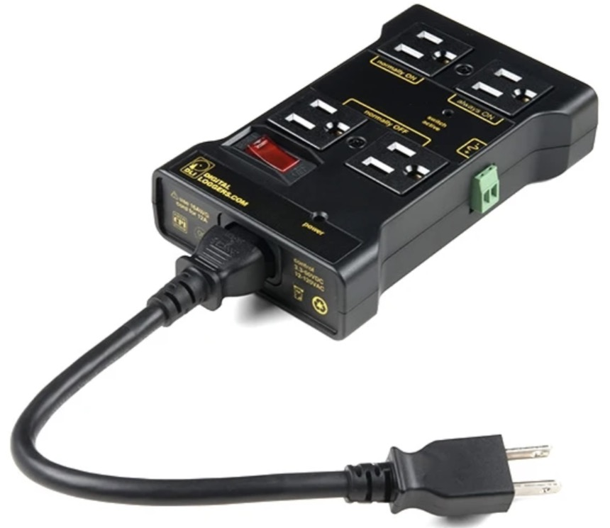

## Athan Clock on ESPHome (ESP8266)

This is a small, hobby project to build an Athan (call to prayer) clock using ESPHome and an ESP8266 (D1 Mini). It plays Athan audio from a DFPlayer Mini, shows the next prayer on a small OLED, and reads daily prayer times from simple JSON files that can live in any GitHub repo.

I could not find an ESPHome-based project that let me keep my own JSON files for my local mosques and reuse the same device when I move, so I ended up building this and decided to share it in case it helps someone else.

If you already **have the device in your hands**, the quickest path is:

1. Plug it into power and wait about **2–3 minutes**.
2. A temporary Wi‑Fi network (access point) called something like `AthanFallbackHotspot` will appear. The corresponding password is `athan404`.
3. Connect to that network from your phone/laptop; a **captive portal** will open (or visit `192.168.4.1` in a browser).
4. Choose your home Wi‑Fi, enter the password, and save.
5. The device will reboot, connect to your Wi‑Fi, fetch the correct time and prayer JSONs, and then start showing the current time and next prayer.

After that first setup you normally **do not need to touch Wi‑Fi again**; you only use the two front buttons to change Athan audio, hourly tick, location, volume, or to trigger firmware updates.

If the **built‑in speaker** connected directly to the PCB is not loud or clear enough in your space, you can instead plug an external amplified speaker into the AUX jack (for example, any small PC speaker that has its own power/volume). In that case, please disconnect or switch off the onboard speaker using the small speaker switch on the PCB so that only the external speaker is used.

For more detail:

- **Section 1 – Using the device**: day‑to‑day usage, buttons, menus, Home Assistant.
- **Section 2 – Building your own device**: hardware, wiring, PCB, enclosure.
- **Section 3 – SD‑card for audio**: how to prepare the microSD so DFPlayer file numbers match the firmware.
- **Section 4–5 – Mosques and JSON**: how prayer times and timezones are stored and hosted.
- **Section 6 – Developers**: internal logic and how to extend `athan.yaml`.

---

### Limitations (please read first)

- **Wi‑Fi band:** The ESP8266 only connects on 2.4 GHz. It cannot see 5 GHz‑only Wi‑Fi networks. If your router exposes both bands, make sure the 2.4 GHz SSID is enabled.
- **HTTP (no HTTPS for JSON files):** Prayer JSON files and firmware update metadata are fetched over plain HTTP. This keeps things simple for this small microcontroller. If you need HTTPS everywhere, you will likely want to port the idea to a newer board.

---

### Who this repo is for

- **1. People who already have the device in hand**  
	You mainly want to know how to use it: buttons, menus, locations, volume, and what can be changed from Home Assistant.

- **2. People who want to assemble their own unit**  
	You are comfortable with basic electronics and 3D printing. You want the PCB, wiring, enclosure, and a ready ESPHome YAML to flash.

- **3. People who want to change the code / logic**  
	You want to tweak how JSON is parsed, add more locations, or change the UI. For that, please see `DEVELOPER.md` after skimming this page.

---

### Quick tour of the hardware

- **MCU:** ESP8266 D1 Mini (`board: d1_mini`).
- **Audio:** DFPlayer Mini module with microSD card and an external speaker.
- **Display:** SSD1306 128×64 I2C OLED.
- **Buttons:** Two momentary push buttons on the front:
	- **Next** (connected to `GPIO14` in the YAML).
	- **Select** (connected to `GPIO12`).
- **External relay:** One relay output on `GPIO13`, exposed to Home Assistant as a switch (e.g., to drive an external amplifier, light, or another low‑voltage load through a proper relay board).
- **PCB + enclosure:** KiCad project and 3D enclosure files live under `hardware/pcb/athanV1_PCB/`.

Pictures (these will show once you add photos to `images/`):

```markdown


```

```markdown

```

---

## 1. Using the device (for people who already have one)

You do not need to edit any YAML to use the clock day‑to‑day. Everything here is done from the two buttons.

If I already assembled and sent you a device, the microSD card inside the DFPlayer is also **already prepared** with the correct audio files. The SD‑card section later in this README is only needed if you are building or changing the audio yourself.

### 1.1 Power‑up and Wi‑Fi

- On first power‑up the device tries to connect to the Wi‑Fi and fails (no credentials yet). It then starts a temporary access point called `AthanFallbackHotspot`. The corresponding password is `athan404`.
- Connect to that network from your phone or laptop. A captive portal should open automatically; if not, visit `http://192.168.4.1`.
- Choose your home Wi‑Fi SSID, enter the password, and save. The device will reboot and connect to your Wi‑Fi.
- If Wi‑Fi is down it still shows time once it has synced at least once; it will retry and update prayer times automatically when it comes back.

There is another way to clear Wi‑Fi credentials at boot by holding both buttons while powering up. This forces the device into captive portal mode so you can set a new Wi‑Fi network.

### 1.2 Normal screen

In normal mode (no menu open), the OLED shows:

- Current time and compact date.
- Name and time of the next prayer.
- Remaining time to the next prayer.

When the scheduled time is reached, the DFPlayer plays the chosen Athan file and the built‑in LED blinks. You can stop the Athan at any point with either button (see below).

### 1.3 Buttons

- **Next button (short press):**
	- When no menu is open: also acts as a quick “silence” button.
	- Inside a menu: moves forward through options or choices.

- **Select button (short press):**
	- If Athan is playing: stops the audio.
	- From the normal screen: opens the main menu then duals as a select button.

If you leave the menu untouched for about a minute, it closes automatically and goes back to the normal screen.

> **Note about speakers and the AUX jack**  
> The PCB supports directly-connected speaker **and** an AUX jack for an external amplified speaker. If the onboard speaker is not good enough (too quiet or distorted), you can plug an external powered speaker into the AUX jack and then disconnect or switch off the onboard speaker using the speaker switch on the PCB so only the external speaker is active.

> **Note about the `Q:` option in the main menu**  
> Some builds expose an advanced `Q:` entry in the main menu. This is **off by default**, and normal day‑to‑day use does **not** require changing it. If it’s ever turned **On** accidentally and you are not sure what it does, the device might behave a bit differently from what you expect. In that case, you can set it back to **Off** from the same menu.
### 1.4 Main menu items

The main menu has these entries, cycled with **Next** and chosen with **Select**:

1. **Athan audio** – preview and choose which Athan file is used.
2. **Hourly tick** – optional short sound at the top of each hour. The first choice in the list is “None” to disable it.
3. **Location** – choose which mosque/location profile the device should use.
4. **Update firmware** – check if a newer firmware version is available and, if so, apply it over the air.
5. **Volume** – change volume in 10% steps.
6. **(Optional) Q:** – an internal/advanced setting. It is **false/off by default** and you normally do **not** need to change it. If you happen to turn it **On** and then notice the device behaving in a way you did not expect, simply switch it back **Off** from this menu and things will return to normal.
7. **Exit menu** – go back to the main screen.

#### 1.4.1 Choosing Athan audio

- Open **Athan audio** from the menu.
- Use **Next** to preview different Athan recordings from the microSD card.
- Press **Select** to store the currently previewed file as the default.

The firmware expects up to 10 Athan files on the DFPlayer card, numbered in the order they were copied (see SD‑card section below).

#### 1.4.2 Hourly tick

- Open **Hourly tick** from the menu.
- Use **Next** to cycle through “None” and up to 10 different short sounds.
- Press **Select** to store your choice.

If you choose a sound, it will play once at the start of each hour (when the device is not already playing Athan).

#### 1.4.3 Location

- Open **Location** from the menu.
- Use **Next** to move through the list of locations.
- When you press **Select**, the device fetches a small JSON timezone file for that location, applies it, and refreshes the daily prayer times.

The list currently has 15 slots; some are already mapped to real mosques and others are placeholders (see “Mosques and JSON files” below).

#### 1.4.4 Update firmware

- Open **Update firmware** from the menu.
- First press of **Select** checks a small `latest.json` file in the JSON host repo.
	- If your device is already on the latest version, the display will say so.
	- If a newer version exists, the screen will show the new version number.
- Press **Select** again to confirm and let the device download and install the new firmware.

This uses ESPHome’s OTA support and a simple HTTP endpoint. You do not need to connect the USB cable for these updates.

When you host your own firmware, make sure the corresponding `.md5` file contains **only** the raw MD5 checksum string (no filename, no extra text or spaces), otherwise the integrity check will fail.

#### 1.4.5 Volume

- Open **Volume** from the menu.
- Use **Next** to step through volume in 10% increments.
- Press **Select** to keep the current level.

The device plays a short tone at the new volume so you can hear the change.

### 1.5 Home Assistant integration

Because this is an ESPHome device, you can add it to Home Assistant in the usual way.

Out of the box the following are especially useful:

- **A switch for the external relay** (`external_relay`).  
	You can use this to switch a small external relay module, an amplifier, or another external circuit. I usually use it with the `IoT Power Strip` shown in the picture (can easily find on different stores).
	
- **API / OTA support** via ESPHome for upgrades.
- **web server** I have this disabled which is an alternative way to control the relay from a browser. However, if you want me to enable it, let me know and I can add it back in next update.

---

## 2. Building your own device (hardware and assembly)

If you want to assemble the clock from scratch, this section gives you the main pointers. The detailed wiring is in `WIRING.md` (which you don't really need because the schematic is already provided) and the PCB parts list is in `BOM.md` (which in turn points to the KiCad‑generated BOM files under `hardware/pcb/athanV1_PCB/`).

### 2.1 Hardware overview

- ESP8266 D1 Mini (or equivalent ESP‑12 module).
- DFPlayer Mini audio module with microSD card.
- SSD1306 128×64 I2C OLED display.
- 2 × momentary push buttons for **Next** and **Select**.
- Optional relay module connected to `GPIO13`.
- 5 V power input and a 3.3 V regulator for the ESP8266.
- PCB and enclosure from `athanV1_PCB/` (KiCad project and 3D file).


### 2.2 Wiring

`WIRING.md` contains the full pin table and decoupling notes. In short:

- I2C OLED on `GPIO4` (SDA) and `GPIO5` (SCL) plus reset on `GPIO16`.
- DFPlayer on hardware UART (`GPIO1` TX, `GPIO3` RX) and powered from 5 V.
- Built‑in LED on `GPIO2`.
- Next button on `GPIO14`, Select button on `GPIO12`, both using internal pull‑ups.
- External relay on `GPIO13`.

If you prefer breadboard wiring instead of the PCB, you can still follow the same pins used in `athan.yaml`.

### 2.3 PCB, schematic and enclosure

- All KiCad files (schematic, layout, and project settings) are under `hardware/pcb/athanV1_PCB/`.
- 3D model(s) for the enclosure are under `hardware/pcb/athanV1_PCB/generated_imgs_and_3d/`.

You can open these in KiCad (it's an open source tool), tweak dimensions, circuit, and export new manufacturing files as needed.

### 2.4 Programming, DFPlayer and UART jumpers

This subsection is mainly for people assembling and flashing their own boards. The order in which you solder and program things matters a bit because the DFPlayer shares the same hardware UART pins as the ESP8266 programming header.

- The DFPlayer’s RX/TX are connected to the ESP8266 hardware UART on `GPIO1` (TX) and `GPIO3` (RX).
- Those same pins are what USB‑to‑serial programmers use to flash the ESP (`ESP_TX` / `ESP_RX`).
- Once the DFPlayer is soldered to those lines, direct programming over the serial header becomes difficult unless you temporarily disconnect it.

Because of that, the **recommended order** when building a fresh board is:

1. Solder the ESP8266 module, power circuitry and headers.
2. **Do not solder the DFPlayer yet.**
3. Connect a USB‑to‑serial adapter to the programming pins on the PCB (`ESP_VCC`, `GND`,`GPIO0`, `ESP_RX`, `ESP_TX`).
4. Flash the firmware at least once over the serial connection.
5. Only after that, solder the DFPlayer module in place.

Any common 3.3 V USB‑to‑TTL serial adapter will work (for example modules based on CP2102, CH340, FT232, etc.). Make sure it is set to **3.3 V logic** and matches the board’s `ESP_VCC` level 3.3 V (do not feed raw 5 V directly into the ESP8266 3.3 V rail).

To put the ESP8266 into flashing mode when using the pins directly:

- Connect `GND` on the adapter to `GND` on the board.
- Connect the adapter’s TX to `ESP_RX` and adapter’s RX to `ESP_TX`.
- Hold `GPIO0` low (tie to `GND`).
- Provide 3.3 V to `ESP_VCC`.
- Make sure to hold `GPIO0` low (tie to `GND`) while you power‑up; this makes the ESP8266 boot into the serial bootloader.
- Then use your chosen tool (ESPHome, `esptool.py`, web flasher, etc.) to upload the firmware. A convenience tool I use is `web.esphome.io` in a supported browser.

Starting from the **second PCB revision (including the current one)**, the UART lines going to the DFPlayer go through a small solder jumper. That jumper is **bridged by default** so the ESP UART talks to the DFPlayer once everything is assembled.

- If you follow the recommended order above, simply **flash the ESP first**, then solder the DFPlayer, and leave the jumper as‑is.
- If you already soldered the DFPlayer and need to re‑flash via the serial header, you can **cut the solder jumper** that ties TX/RX to the DFPlayer pads, flash the ESP again, and then re‑bridge the jumper with a small blob of solder afterwards.
- As another fallback, you can temporarily desolder the DFPlayer module itself, program the ESP, and then resolder it. The jumper allows for a clean way to isolate it without removing the whole module.

Once the firmware has been flashed **at least once**, you have several **OTA update** options that do not require touching the UART again:

- Normal OTA over Wi‑Fi using ESPHome (CLI/Home Assistant add‑on) as long as the device can reach your network.
- Fallback AP / captive‑portal OTA: even without internet (or after resetting by pressing both buttons together while powering up), if the device boots into the ESPHome captive portal (e.g. `AthanFallbackHotspot`), you can connect to `http://192.168.4.1` from a laptop and upload a new firmware `.bin` file from there.

As of the software programming in this project, you can flash the firmware in three main ways:

- Build from source using `firmware/athan.yaml` with ESPHome (local or Home Assistant add‑on), and flash over serial the first time then OTA afterwards.
- Or use a pre‑built binary such as `firmware/athanV1.bin` and flash it using:
	- `web.esphome.io` (in a supported browser, with your USB‑to‑serial adapter selected), or
	- any other ESP8266 flashing tool that can write a `.bin` file via the serial bootloader.
- Using the c build included in the firmware folder with vscode platformio.

#### 2.4.1 SSD1306 display footprints on the PCB

The PCB is designed to accept several common SSD1306 module footprints so you can reuse whatever display you have on hand:

- **8‑pin modules:** a full 8‑pin header footprint.
- **4‑pin I2C modules:** two separate 4‑pin footprints with the two most popular pin orders (for example `GND–VCC–SCL–SDA` and `VCC–GND–SCL–SDA`). Use the one that matches the silkscreen on your display.
- **7‑pin SPI module:** a 7‑pin footprint is also present, but the current firmware only uses the I2C interface; SPI SSD1306 modules are **not** supported in the provided `athan.yaml` (however changing that part of the code should be straightforward using any AI assistant).

---

## 3. SD‑card for audio (DFPlayer)

The DFPlayer uses a simple “file number” scheme based on the order files were copied to the card.

### 3.1 Preparing the card on macOS

1. **Format the card as FAT (FAT16/FAT32)**.
2. Make sure there are **no folders** – put all `.mp3` (or supported) files directly in the root of the card.
3. Copy the audio files in the exact order you want them to be numbered (first copied file becomes file `1`, second becomes file `2`, and so on).
4. macOS may create hidden files (`.DS_Store`, `._*`, etc.). To clean them up, run:

	 ```bash
	 cd /Volumes/YOUR_SD_CARD_NAME
	 rm -rf .DS_Store .Trashes ._*
	 ```

5. Eject the card safely, insert it into the DFPlayer, and power‑cycle the device.

### 3.2 File layout expected by the firmware

The YAML uses these ranges by default:

- Files **1–10:** Athan recordings (selectable and previewable from the menu).
- Files **11–20:** Hourly tick sounds (also selectable from the menu).
- Files **21–23:** A few fixed indices are used for small UI sounds (for example, menu clicks). You can keep those as short beeps.

You can always change the mapping later in `athan.yaml`, but this default is enough to get started.

---

## 4. Mosques, JSON files and timezones

One of the main goals of this project is to keep a very simple, transparent JSON structure for prayer times that is easy to host on GitHub and adjust per mosque.

### 4.1 Where the JSONs live by default

- By default the firmware points to my `athan_json` repository using a GitHub mirror service (raw.githack URLs).
- For each day of the year and each supported location, there is a tiny JSON file with the times for that day.
- For each location there is also a small timezone JSON file with a single `TZ` field.

For the Davis mosque, the starting data was taken from Dr. Albara Ramli’s website: <https://albara.ramli.net/ar/> and then converted into these daily JSON files (see `break_json.py` for how the large source file is split).

### 4.2 JSON structure

Each **daily prayer JSON** looks roughly like this (simplified example):

```json
{
	"fajr": "06:06 ",
	"sunrise": "07:20 ",
	"doha": "08:00 ",
	"dhuhar": "12:15 ",
	"asr": "15:45 ",
	"maghrib": "17:10 ",
	"isha": "18:30 "
}
```

The firmware removes extra spaces and converts these into 24‑hour hours/minutes internally. Some additional logic makes sure that afternoon times are treated correctly as PM.

Each **timezone JSON** is even simpler, for example:

```json
{ "TZ": "PST8PDT,M3.2.0,M11.1.0" }
```
Note: The TZ string format follows the POSIX convention used in many Unix‑like systems. You can find your location’s TZ string from sources like the [posix_tz_db](https://github.com/nayarsystems/posix_tz_db/blob/master/zones.csv) or your operating system. Using `Continent/City` format (e.g., `America/Los_Angeles`) doesn't work reliably with this esphome software component.

### 4.3 URL pattern used in the firmware

In `athan.yaml` you will see two small arrays of location keys:

```cpp
"davis","santaclara","sacramento","masjid4",...,"masjid15"
```

They are used to build URLs like:

- **Timezones:**

	`http://raw.githack.com/et7ad/athan_json/master/docs/timezones/<key>.json`

- **Daily times:**

	`http://raw.githack.com/et7ad/athan_json/master/docs/athantimes/<key>/<year>/<DDD>.json`
Where `<year>` is the four‑digit year and `<DDD>` is the day of year, zero‑padded (e.g. `001.json`).

Because GitHub itself only serves these files over HTTPS, I used a small GitHub mirror (raw.githack) that exposes a simple HTTP endpoint suitable for this ESP8266 firmware. The mirror does not change the contents of the files; it only re‑serves them over HTTP. If you prefer, you can very easily replace this with:

- your own small HTTP server,
- a GitHub Pages site fronted by a custom domain that offers HTTP, or
- any other host that can serve the same JSON structure over plain HTTP.

To do that, simply change the base URLs in `athan.yaml` and rebuild/flash.

### 4.4 Current location list and real mosques

The firmware currently exposes 15 slots. Some are already in active use, others are placeholders for future mosques.

| Slot | Key         | Mosque / description                     | Maps link (example) |
|------|------------|-------------------------------------------|----------------------|
| 1    | `davis`     | Islamic Center of Davis                  | https://maps.app.goo.gl/TS9X4CXDYKfkRHph6 |
| 2    | `santaclara`| Santa Clara area mosque (to be detailed) | (link to be added)   |
| 3    | `sacramento`| Sacramento area mosque (to be detailed)  | (link to be added)   |
| 4–15 | `masjid4`…`masjid15` | Reserved / placeholders                 | (to be assigned)     |

I plan InSha2Allah, to keep maintaining the JSON files for the mosques in this table. If you would like one of the placeholder slots (4–15) to be used for your mosque, please open an issue or contact me with the details, and I will try to add it and include it in a later firmware build.

---

## 5. Hosting your own JSON repo

If you prefer to keep control of the JSON files yourself, you can host them in your own GitHub repo (or any HTTP‑reachable server) and point the device to it.

High‑level steps:

1. Create a new repository and mirror the folder layout used in `athan_json`:
	 - `docs/timezones/<key>.json` for timezones.
	 - `<key>/<year>/<DDD>.json` for daily prayer times.
2. Generate or copy JSON files for your mosque(s). You can adapt `break_json.py` in this repo as a starting point if you have a large CSV or JSON with a full year of times.
3. In `athan.yaml`, update the base URLs inside the `change_location_handler` and `load_prayer_times` scripts to point at your own repo or domain.
4. Recompile and flash the firmware with ESPHome.

Because the JSON format is intentionally very small and regular, this approach works well even on a simple ESP8266 over plain HTTP.

---

## 6. Code and internals (for developers)

If you plan to change the logic, add more menu items, or extend the formats, please see `DEVELOPER.md`. It covers:

- A tour of the important globals and scripts in `athan.yaml`.
- How the next prayer is computed.
- How the HTTP requests are made and parsed.
- How to add new locations and JSON sources cleanly.

ESPHome handles most of the low‑level work; the YAML is mostly about small pieces of C++ logic to glue everything together.

---

## 7. Similar projects and why this exists

- **ESP32 Audio – Muslim Prayer Time (Solat Time) on ESP32**  
	<https://fornextlife.wordpress.com/2021/03/07/muslim-prayer-time-on-esp32/>  
	Uses an ESP32 with Arduino code, an external API (originally `api.azanpro.com`) for prayer times, an LCD, and audio playback. It even includes a nice browser‑based configuration page for Wi‑Fi and API settings via SPIFFS. It is very flexible for zones covered by that API.

- **Islamic Prayer Times – ESP32 TTGO T‑Display**  
	<https://www.instructables.com/Islamic-Prayer-Times-ESP32-TTGO-T-Display/>  
	An ESP32 TTGO project that uses Muwaqqit and several Google APIs (geolocation, maps, timezone) to automatically find the user’s position, show a map and qibla, and display times on a colour TFT. It has deep integration with external services and a richer UI.

Those projects are feature‑rich in many ways and they may be more suitable for your needs so check them out. However, this project is trying to fill a small gap: a straightforward, ESPHome‑based Athan clock that can follow you as you move, as long as you provide the JSON data for your new masjid.

- It uses **ESPHome** instead of a custom Arduino sketch, so it utilizes the ESPHome ecosystem and its services it also slots easily into Home Assistant.
- It avoids online “calculation APIs” and instead works from **simple JSON data per mosque**, so you can be sure the times match what your local masjid actually uses.
- It keeps the firmware logic simple and moves the location‑specific details into data files that can live in Git.
- It allow me to have half of the device controlled through the hosted files, so I can simply change the behaviour of the same device by updating JSON files instead of having to reupdate the firmware every time I need to add mosques or change times.
---

## 8. Building one for someone else

If someone is interested in having a unit but cannot or does not want to assemble it, I am happy to help (Whenever I have some free time ;-;):

- If I already have spare parts around, I am happy to build and share one (free).
- Otherwise, you can send or cover the components and I can assemble and flash it.

Feel free to reach out through the repository if this is something you need.

---

## 9. Contributing, feedback and issues

This is a small hobby project I originally built for my own use. In many places the beautiful Athan is simply not called publicly, and I wanted a compact, reliable way to hear it at the right times — matching the timetable of my local mosque — without needing to reprogram the device every time I moved or share it with a friend. I couldn’t find an ESPHome-based project that supported custom JSON prayer-time files and flexible location handling, so I put this together and decided to share it in case it is useful to others as well.
If you notice a bug, run into unexpected behaviour, have an idea for improvement, or would like your mosque added to the supported list, please feel free to open an issue or reach out. Even small suggestions make the project better for everyone, and I try to respond when I can.

The project is MIT-licensed, so you are welcome to fork it, adapt it, or extend it however you like.

