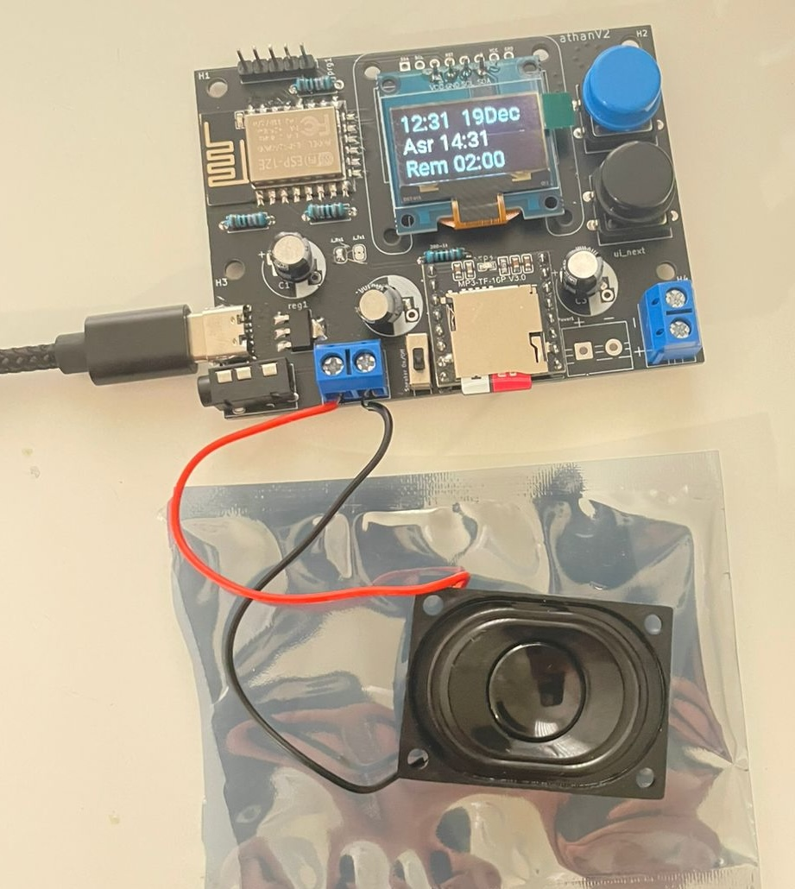
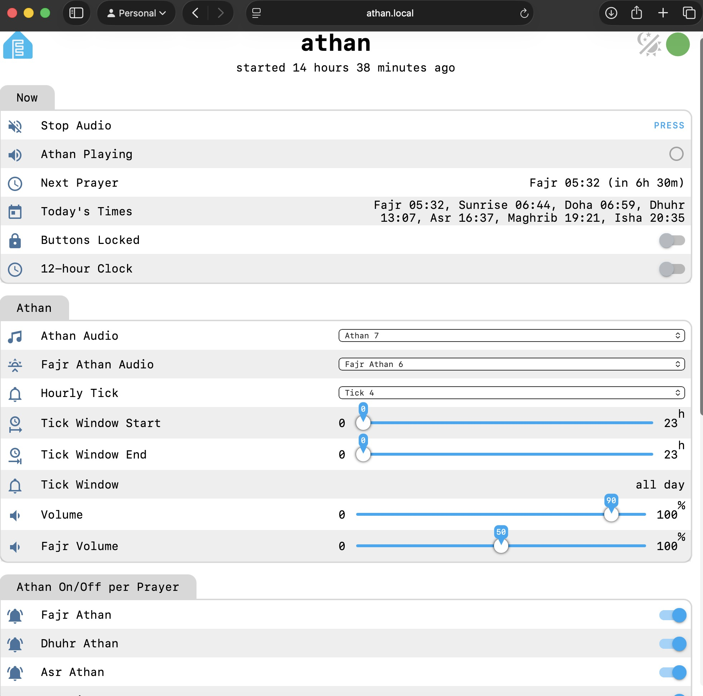
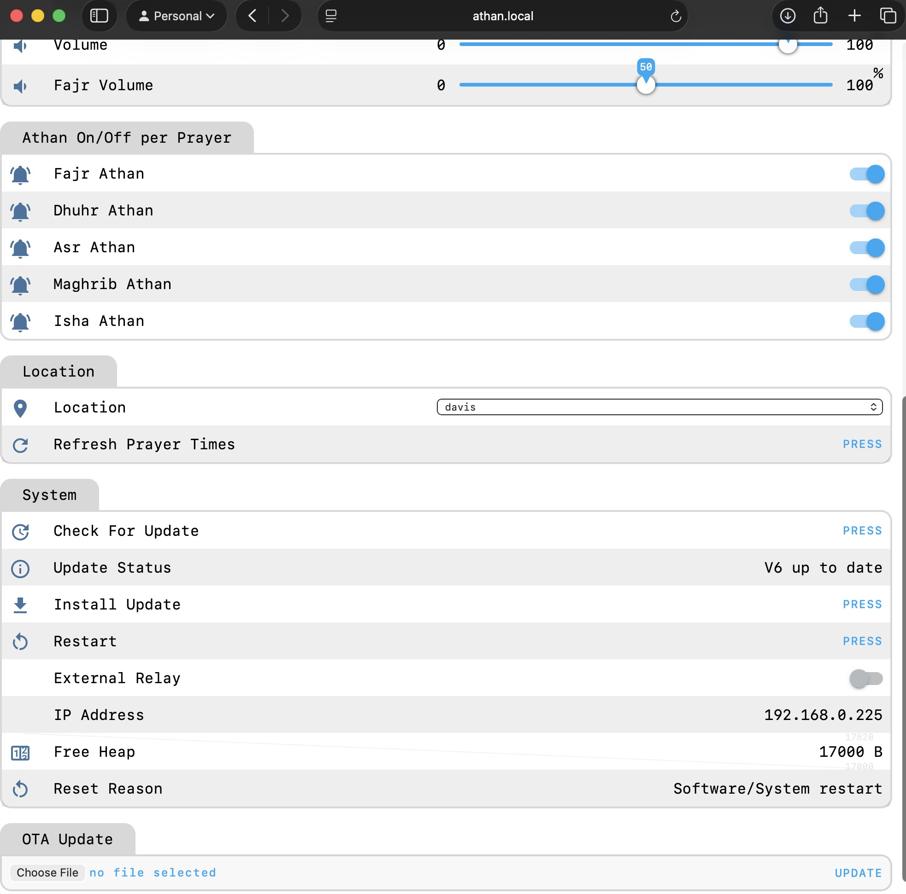
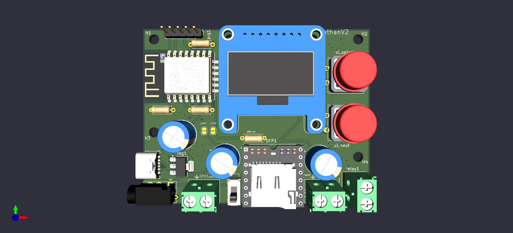
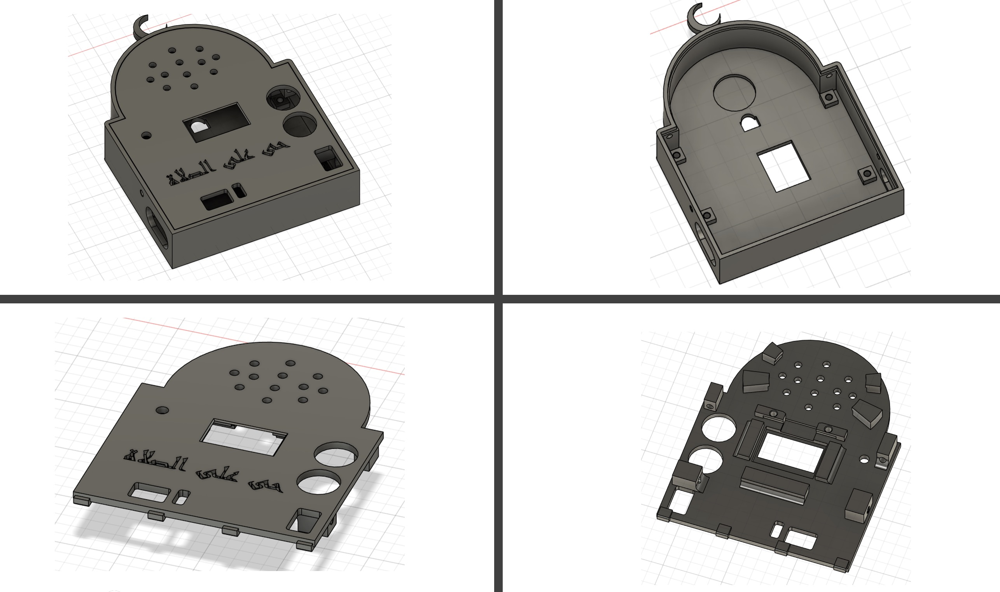

# Athan Clock (ESPHome on an ESP8266)

A small clock that calls the Athan at the exact times of your local mosque. It shows the time and the next prayer on a little screen, plays the Athan through a speaker, and takes its prayer times from tiny JSON files that live in this repository (or any other repository in case you want to replicate the project on your own), one file per day per mosque. This project was built because I could not find one that follows my own mosque's timetable and keeps working when I move.



**Who should read what**

| You are... | Read | Why |
|---|---|---|
| **Someone who was given a device** | **Section 1 only.** | Everything you need to set it up should be in this section. |
| Someone who wants to build one | Section 2 | Parts, wiring, PCB, 3D printed case, preparing the memory card. Needs soldering and a bit of patience. |
| Someone who wants to add a mosque's timetable, or host the data yourself | Section 3 | How the prayer times are stored and served. |
| Someone who wants to change how the firmware behaves | Section 4 and `DEVELOPER.md` | The code is one ESPHome file; the internals are documented there. |

---

## 1. You have the device in your hands

Setting it up is two steps. One, you connect it to your home Wi‑Fi. After that, everything is set from a web page that the clock itself shows on your phone or computer. You can alternatively use the two buttons on the front to do the same things (I think the web page is faster though).

### 1.1 First power‑up: connect it to your Wi‑Fi (once)

1. Plug it in and wait > **2 to 3 minutes**.
2. On your laptop (or phone), open the Wi‑Fi list. A network called **`AthanFallbackHotspot`** appears. Join it with the password **`athan404`**.
3. A page opens by itself asking for your home Wi‑Fi. If it does not, open a browser and go to `192.168.4.1`.
4. Pick your home Wi‑Fi (or enter its SSID manually), type its password, save.
5. The clock restarts, joins your Wi‑Fi, sets its own time from the internet, downloads today's prayer times, and shows the time and the next prayer. From then on it does this by itself every day.

Two things to know:

- The clock only sees **2.4 GHz** Wi‑Fi networks. Most home routers have one; if yours shows two networks (for example "home" and "home‑5G"), pick the one without "5G".
- If you move it to another home, just plug it in: when it cannot find the Wi‑Fi it knows, it opens the `AthanFallbackHotspot` network by itself after two or three minutes, and you repeat steps 2 to 4. However, if you want to make it **forget** a Wi‑Fi when that network is still in range (for example to move the clock to a different network in the same home): plug it in **while holding both front buttons**, then let go. Within a little while the LED blinks twice, the clock restarts, and the hotspot appears.

### 1.2 Set everything from the web page

On a phone or computer connected to the same Wi‑Fi, open a browser and go to:

**`http://athan.local`**

If that address does not open (it depends on your phone and router, and Android phones usually cannot open `.local` names), use the clock's own IP address instead: on the device use the two buttons, press **Select** (the upper button), then press **Next** (the lower button) until the screen says **Info**, press **Select** again, and the screen shows an address like `192.168.1.42`. Type that into the browser. Your router's app or admin page also lists it, under the name `athan`. (optional): You usually can tell your router to always give the clock the same address (this is often called "DHCP reservation" or "static lease") and bookmark it.

<table><tr>
<td></td>
<td></td>
</tr></table>

The page is organised in groups:

- **Location** – your mosque. Pick it from the list and the clock downloads that mosque's timetable and time zone. The list of mosques is in section 3.4; if yours is missing, ask me and I will add it.
- **Athan Audio** – which athan-recording is used for Dhuhr, Asr, Maghrib and Isha. Changing it plays a 20‑second preview.
- **Fajr Athan Audio** – which athan-recording is used for Fajr. Also previews.
- **Volume** and **Fajr Volume** – the Fajr Athan has its own volume, so it can be gentler at dawn (or more loud if you want to count on it to wake you up 😴).
- **Hourly Tick** – an optional short sound at the top of every hour, and **Tick Window Start / End** to allow it only between two hours (for example 7 to 22 so it stays quiet at night). Start equal to End means all day. You can completely turn it off by choosing **None** for the sound.
- **Fajr / Dhuhr / Asr / Maghrib / Isha Athan** – five switches to turn the call off for a particular prayer. The clock still shows and counts down to that prayer; it just stays silent. Visual cue: if the Athan is off, the next prayer name on the screen is partially str~~icken~~-thr~~oug~~
- **12‑hour Clock** – show `5:04 PM` instead of `17:04`.
- **Buttons Locked** – makes the two front buttons do nothing except silence the sound (I guess mainly for kids?). See 1.3 for how to unlock without the page.
- **Stop Audio** – silences whatever is playing right now.
- **Next Prayer**, **Today's Times**, **Athan Playing** – just information.
- **Check For Update / Install Update** – firmware updates, see 1.4.
- **Restart**, **External Relay**, **IP Address**, **Free Heap**, **Reset Reason** – restart the clock; switch the relay output if you connected something to it; the address to type in your browser; and two numbers for degbugging purposes that I may ask you for if something goes wrong.

Anything you change on the page takes effect immediately, and the page always shows what the clock is currently doing, even if it was changed with the buttons.

### 1.3 The screen and the two buttons

The screen normally shows three lines: the time and date, the next prayer and its time, and how long until it. A small padlock in the bottom‑right corner means the buttons are locked. A crossed circle with a **W** means the clock has lost Wi‑Fi (it keeps working; it just cannot download tomorrow's times until Wi‑Fi is back).

The two buttons:

- **Select** (upper) – opens the menu. Inside the menu it confirms. While the Athan is playing it silences it.
- **Next** (lower) – inside the menu it moves to the next item. On the normal screen it silences the Athan if one is playing; otherwise it toggles the relay output.

The menu closes by itself after a minute without presses. Its items, in order:

| Item | What it does |
|---|---|
| Athan | choose the recording for Dhuhr, Asr, Maghrib, Isha (Next previews, Select keeps) |
| Fajr Athan | choose the recording for Fajr (previews at the Fajr volume) |
| Athan On/Off | Next moves through Fajr, Dhuhr, Asr, Maghrib, Isha; Select flips one on or off; Select on **Done** leaves |
| Hourly Tick | choose the hourly sound, or None |
| Tick Window | Next moves between Start, End and Done; Select on Start or End lets Next change the hour; Select again confirms. The third line always shows how long the window is |
| Location | your mosque |
| Update | first Select checks for a new firmware, second Select installs it |
| Volume | Next lowers by 10 % (wraps around to 100 %), a tone plays at the new level, Select keeps |
| Fajr Volume | the same, for Fajr |
| Clock | Select flips between 24h and 12h |
| Lock Buttons | Select locks the buttons and returns to the clock |
| Info | firmware version, the clock's IP address and its `athan.local` name |
| Cancel | back to the clock |
| Q | an advanced option that is **off** by default. If it is ever **ON** press select to turns it off |

To **unlock** the buttons without the web page: unplug the clock, then plug it back in while holding **one** of the two buttons (either one). The LED blinks three times quickly and the buttons work again.

### 1.4 Living with it

- **At prayer time** the Athan plays and the LED stays on for a few minutes. Either button, or **Stop Audio** on the page, silences it. Sunrise and Doha are shown but never call.
- **Fajr** uses its own recording and its own volume, the ones you chose under Fajr Athan Audio and Fajr Volume.
- **Firmware updates** need no cable. On the page press **Check For Update**; if a newer version exists, **Install Update**. On the device: menu, **Update**, Select twice. The clock restarts by itself when done.
- **No screen?** The clock works without it: it still calls the Athan and serves the web page. If you plug a screen in later it comes alive within about 10 seconds.
- **Speaker too quiet?** The board has a jack for an external powered speaker (any small PC speaker with its own power). Plug it in and flip the small speaker switch on the board so only the external one is used.

### 1.5 If something is off

- **`athan.local` does not open.** Use the IP address instead (section 1.2). Android in particular never opens `.local` names. Some routers also answer `http://athan/` or `http://athan.lan/`.
- **The buttons do nothing.** Look for the padlock in the corner: the buttons are locked. Switch **Buttons Locked** off on the page, or unplug and replug while holding one button.
- **The sound is wrong: nothing plays, several clips play one after another, the wrong recording, or it keeps playing on its own.** The audio module inside is probably a clone of a common MP3 player and occasionally gets confused, most often right after a button press. The firmware already avoids the usual triggers, but when it happens the fix is simple: **unplug the power and plug it back in.** That is all it needs.
- **The screen is dark or frozen.** Screens clones occasionally lock up; unplug and replug fixes them too. If you unplugged the screen yourself while the clock was running, plugging it back in is handled once; a second time needs a power cycle. The clock keeps calling the Athan meanwhile.
- **The time or the prayer times look wrong.** Check the Wi‑Fi mark on the screen and the **Location** on the page, then press **Refresh Prayer Times**. The clock can only download times when it is online; if it has been offline for more than a day it keeps yesterday's times until it reconnects.
- **You want to see the last restart reason or the memory.** They are the last two rows on the page. If **Reset Reason** ever says `Exception`, tell me; it is not expected.

### 1.6 Home Assistant (optional)

If you run Home Assistant, add the clock through the ESPHome integration; it is discovered automatically. When asked for the key, use:

`jAOYf5QQGoONCqGQnC7fwPhSeb/ZTUTlawp1Lvu63ZI=`

Everything on the web page becomes an entity in Home Assistant: the selects, sliders, switches, buttons and readouts. The **External Relay** switch is handy for things like the IoT power strip below, to switch an amplifier or a light with the Athan.


That is the end of what a device owner needs. The rest of this page is for people building, feeding or changing the clock.

---

## 2. Building your own device

For people who are comfortable with basic electronics and 3D printing and want to assemble a unit from scratch. You will end up with the same device described in section 1.

### 2.1 Parts

- ESP8266 D1 Mini (or an ESP‑12 module, as on the PCB).
- DFPlayer Mini MP3 module with a microSD card.
- SSD1306 128×64 I2C OLED display.
- Two momentary push buttons (Next, Select).
- Optional relay module on `GPIO13`.
- 5 V input, 3.3 V regulator for the ESP8266, a speaker or an external powered speaker on the jack.

The parts list with pictures is in `BOM.md`, which points at the KiCad‑generated BOM files under `hardware/pcb/athan_kicad/BOM/`.

### 2.2 Wiring

`WIRING.md` has the full pin table and decoupling notes. In short:

- OLED on I2C: `GPIO4` (SDA), `GPIO5` (SCL); reset on `GPIO16` (only 7/8‑pin modules have it).
- DFPlayer on the hardware UART: `GPIO1` (TX) and `GPIO3` (RX), powered from 5 V.
- Built‑in LED on `GPIO2`.
- Next on `GPIO14`, Select on `GPIO12`, both with the ESP's internal pull‑ups.
- Relay on `GPIO13`.

A breadboard build works with the same pins.

### 2.3 PCB and enclosure files

- KiCad project (schematic, layout, settings): `hardware/pcb/athan_kicad/`. Renders: `hardware/pcb/athan_kicad/generated_imgs_and_3d/`.
- Enclosure (STL, STEP, Fusion, and a ready gcode): `hardware/encolsure/Iteration13/`. There are top halves for a round or a rectangular speaker and for two display variants; pick the pair that matches your parts.




The PCB accepts several OLED footprints: an 8‑pin header, two 4‑pin I2C footprints with the two common pin orders (`GND‑VCC‑SCL‑SDA` and `VCC‑GND‑SCL‑SDA`; match your module's silkscreen), and a 7‑pin SPI footprint that the firmware does not use.

### 2.4 Flashing the first time

The DFPlayer shares the UART pins that are also used for programming, so the order matters:

1. Solder the ESP module, the power parts and the headers. **Do not solder the DFPlayer yet.**
2. Connect a 3.3 V USB‑to‑serial adapter (CP2102, CH340, FT232...) to the programming pins: `GND` to `GND`, adapter TX to `ESP_RX`, adapter RX to `ESP_TX`, 3.3 V to `ESP_VCC`. Never feed 5 V into `ESP_VCC`.
3. Hold `GPIO0` to `GND` while powering up; that puts the ESP8266 into its serial bootloader.
4. Flash the firmware. Either build it yourself from `firmware/athan.yaml` with ESPHome (you need a `secrets.yaml` next to it with `wifi_ssid` and `wifi_password`), or flash a released `.bin` with `web.esphome.io` in a supported browser, or any ESP8266 flashing tool.
5. Now solder the DFPlayer.

From the second PCB revision on, the DFPlayer's UART lines pass through a small solder jumper, bridged by default. If you ever need the serial header again with the DFPlayer already in place, cut the jumper, flash, and bridge it again with a blob of solder.

### 2.5 Flashing afterwards (no cable)

- From the device: menu, **Update** (checks `docs/firmwareinfo/latest.json` in this repo, then installs).
- From the web page: **Check For Update** and **Install Update**, or the **OTA Update** form at the bottom of the page where you pick a `.bin` file. In Safari on macOS the file picker greys out `.bin` files; use Chrome, or from a terminal:

  ```bash
  curl -F "update=@/path/to/firmware.bin" http://athan.local/update
  ```

- From the ESPHome dashboard or CLI (`esphome run firmware/athan.yaml`).
- If the clock is in its `AthanFallbackHotspot` mode, `http://192.168.4.1` also offers a firmware upload.

If you host your own firmware for the in‑device update, the `.md5` file next to the `.bin` must contain only the checksum string, nothing else.

### 2.6 Preparing the memory card

The DFPlayer does not care about file names; it numbers files by the **order they were copied** to the card. So the card better be written by the script, not by drag and drop.

1. Format the card as FAT (FAT16/FAT32), no folders.
2. Put the audio files in one folder on your computer, named as in the table below.
3. Open `scripts/sd_card_cpy_script.sh`, set `SRC` (that folder) and `DEST` (the mounted card, for example `/Volumes/AUDIO`), and run it right after the card mounts, before opening the card in Finder.
4. Read its last lines: it should report **48 mp3 files** and then eject the card itself. Do not mount it on the Mac again; put it in the DFPlayer and power the clock.

| Files | Names | What they are |
|---|---|---|
| 1–10 | `A1`–`A10` | Athan recordings, regular wording |
| 11–20 | `B1`–`B10` | hourly tick sounds |
| 21–24 | `C1`–`C4` | short tones used by the menu (22 = volume tone, 23 = click) |
| 25–34 | `D1`–`D10` | audio used by the advanced `Q` option |
| 35–44 | `F1`–`F10` | Athan recordings with the Fajr wording (`F<k>` is usually the same reciter as `A<k>`; if a reciter has no Fajr recording, copy `A<k>` again as `F<k>`) |
| 45–48 | `Z_fallback_1`–`4` | a short "please restart" message that plays if the DFPlayer counts files wrongly; must be last |

Cards made for firmware V5 or older lack the `F` files and must be redone for V6.

Why the script is fussy: on a Mac, copying a file can also create a hidden twin named `._name.mp3`. The DFPlayer counts that twin as a track, and because the card hands a new file the first free slot in its directory, a twin created after your cleanup can land between two real files and shift every number after it. The script copies without those twins, keeps Spotlight and the file‑event logger off the card (two tiny marker files it leaves behind on purpose), repeats its cleanup if macOS re‑creates anything, verifies, and ejects. If you ever see `._` files on the card, format it and run the script again rather than deleting them by hand. The `.fseventsd` and `.Spotlight‑V100` folders macOS sometimes adds are harmless.

### 2.7 3D printing

PLA is fine indoors; PETG or ABS for a warm spot. 0.2 mm layers, 3 to 4 perimeters, 15 to 25 % infill. Print the top and bottom with their flat faces on the bed. Supports are rarely needed if you set the overhang angle to 80° and the horizontal expansion to about 0.8 mm (maybe inside the big side openings and under the crescent).

Thanks to [Ahmed Nader](https://github.com/iNader) for guidance on component placement and to [Omar Ramadan](https://github.com/omarramadan913) for participating in the enclosure 3D design.

---

## 3. Prayer‑time data

For people who want to add a mosque's timetable, correct one, or host the data themselves. The clock never calculates prayer times; it reads them from small text (JSON) files, so it always matches what your mosque publishes.

### 3.1 Where the data lives

By default the firmware reads the `docs/` folder of this repository, served over plain HTTP through the [raw.githack](https://raw.githack.com) mirror (GitHub itself is HTTPS only, which this small chip does not do):

- Time zone per mosque: `docs/timezones/<key>.json`, containing `{ "TZ": "..." }`.
- Daily times: `docs/athantimes/<key>/<year>/<DDD>.json`, one file per day, `DDD` being the day of the year with three digits (`001.json` is January 1st).
- Firmware pointer: `docs/firmwareinfo/latest.json`.

The URLs the firmware builds are `http://rawcdn.githack.com/et7ad/esp_athan/master/docs/timezones/<key>.json` and `http://rawcdn.githack.com/et7ad/esp_athan/master/docs/athantimes/<key>/<year>/<DDD>.json`.

### 3.2 File format

The exact rules are in [prayertimes_specs.md](prayertimes_specs.md); follow it to the letter, the firmware is a small parser. In short: one JSON object per day, every value a string, times as `HH:MM` with leading zeros. Example:

```json
{
  "year": "2025", "month": "1", "#": "Wednesday", "day": "1",
  "fajr": "06:05", "fajr_iqa": "06:30",
  "sunrise": "07:22", "doha": "07:37",
  "dhuhar": "12:15", "dhuhar_iqa": "12:35",
  "asr": "02:44", "asr_iqa": "03:15",
  "maghrib": "05:04", "maghrib_iqa": "05:09",
  "isha": "06:19", "isha_iqa": "08:00"
}
```

The time‑zone file uses the POSIX form, for example `{ "TZ": "PST8PDT,M3.2.0,M11.1.0" }`. Find yours in the [posix_tz_db](https://github.com/nayarsystems/posix_tz_db/blob/master/zones.csv) list; the `Continent/City` form does not work reliably on this chip.

`scripts/break_json.py` turns a whole‑year source file into the daily files, filling missing iqama fields with an offset and computing Doha as sunrise plus 15 minutes. `scripts/santaclara_prayer_times_parser.py` extracts a year from the MCA PDF timetable. The Davis data comes from Dr. Albara Ramli's site (<https://albara.ramli.net/ar/>).

### 3.3 The list of mosques in the firmware

The mosque keys live in exactly one place in `firmware/athan.yaml`: the `options:` list of the **Location** select. The Location menu, the web page and the URLs all read it. The order is what the clock remembers, so existing entries are never moved or removed; new mosques replace the `masjidN` placeholders.

| Slot | Key | Mosque | Map |
|---|---|---|---|
| 1 | `davis` | Islamic Center of Davis, times from Dr. Albara Ramli's site matching his [Iqamah Times](https://albara.ramli.net/iqamah/) app | https://maps.app.goo.gl/TS9X4CXDYKfkRHph6 |
| 2 | `sclaramca` | Muslim Community Association (MCA), Santa Clara, times from [mcabayarea.org](https://www.mcabayarea.org) | https://maps.app.goo.gl/86ttxawSJ9t7fXnEA |
| 3 | `sclaraalnoor` | Masjid Al‑Noor, Santa Clara, times from [mcabayarea.org](https://www.mcabayarea.org) | https://maps.app.goo.gl/ZAGiTFhHkNFhijHBA |
| 4 | `sacramento` | Sacramento area mosque (to be detailed) | |
| 5 | `cairo` | Cairo profile (to be detailed) | |
| 6 | `woodland` | Woodland Mosque, <https://woodlandmosque.com> | https://maps.app.goo.gl/cv6gB9eWJYny81SWA |
| 7–14 | `masjid7`…`masjid14` | placeholders | |
| 15 | `masjid15` | Visalia, California, times from [IslamicFinder](https://www.islamicfinder.org/) (adhan official; iqama and Doha derived); steps in `docs/athantimes/masjid15/README.md` | |

I intend, God willing, to keep the files for these mosques up to date. If you would like a placeholder slot used for your mosque, open an issue or contact me with the details.

### 3.4 Hosting the data yourself

1. Create a repository (or any HTTP server) with the same layout: `docs/timezones/<key>.json` and `docs/athantimes/<key>/<year>/<DDD>.json`.
2. Generate the daily files (adapt `scripts/break_json.py`).
3. In `firmware/athan.yaml`, change the two base URLs (in the `change_location_handler` and `load_prayer_times` scripts) to your host.
4. Build and flash (section 2.4 or 2.5).

---

## 4. Changing the firmware

For people who want to change how the clock behaves. The whole firmware is one ESPHome file, `firmware/athan.yaml`; there is no other source code. Build and flash with:

```bash
# needs a secrets.yaml next to the yaml with wifi_ssid and wifi_password
esphome run firmware/athan.yaml
```

`DEVELOPER.md` explains the internals: the globals and scripts, how the next prayer is computed, how the downloads are parsed, the menu state machine, the web entities, and the limits of the ESP8266 (memory and the saved‑settings store) that shape several decisions. `todo.md` lists planned hardware changes.

A few things worth knowing without opening that file:

- Every control on the web page is also a plain HTTP call, useful for scripts and phone shortcuts:

  ```bash
  curl -X POST http://athan.local/button/stop_audio/press
  curl -X POST "http://athan.local/number/volume/set?value=40"
  curl -X POST "http://athan.local/select/athan_audio/set?option=Athan%203"
  curl -X POST http://athan.local/switch/fajr_athan/turn_off
  curl -X POST "http://athan.local/select/location/set?option=woodland"
  curl http://athan.local/text_sensor/next_prayer
  ```

  `scripts/relay_control.sh` and `scripts/relay_control_native.py` do this for the relay.
- The device's log can be streamed to the web page by setting `log: true` under `web_server:` in the yaml (off by default to save memory).
- The Home Assistant API can be turned off in the yaml to free memory; the comment above the `api:` block says what you lose.

---

## 5. Why this exists, and similar projects

I wanted the Athan called reliably at the times my own mosque uses, without reprogramming anything when I move or give a clock to a friend. Everything mosque‑specific lives in data files in Git, so the same device follows any timetable. It is ESPHome rather than a hand‑written Arduino sketch, so it plugs into Home Assistant and benefits from ESPHome's updates.

Two projects that do more, differently (Good effort MashaAllah):

- [Muslim Prayer Time (Solat Time) on ESP32](https://fornextlife.wordpress.com/2021/03/07/muslim-prayer-time-on-esp32/) uses an online prayer‑time API, an LCD and a browser configuration page.
- [Islamic Prayer Times on an ESP32 TTGO T‑Display](https://www.instructables.com/Islamic-Prayer-Times-ESP32-TTGO-T-Display/) finds your position through Google APIs and shows a map and the qibla on a colour screen.

Both compute or fetch times from services; this one plays exactly what your mosque publishes.

---

## 6. Getting a unit, contributing, license

If you would like a clock but do not want to build one, reach out through the repository. If I have spare parts I am happy to build one for free; otherwise you can cover the components and I will assemble and flash it, whenever I find the time ;-;

Bugs, ideas, or a mosque to add: open an issue. The project is MIT licensed; fork it, adapt it, extend it as you like.
